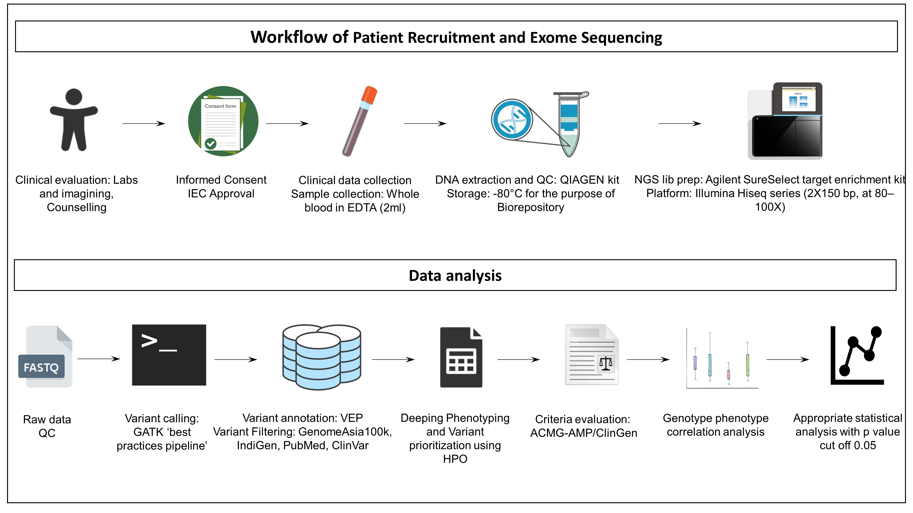
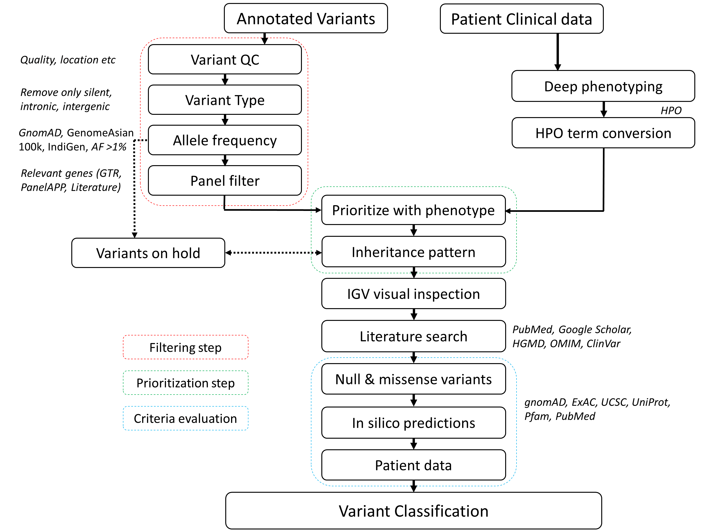
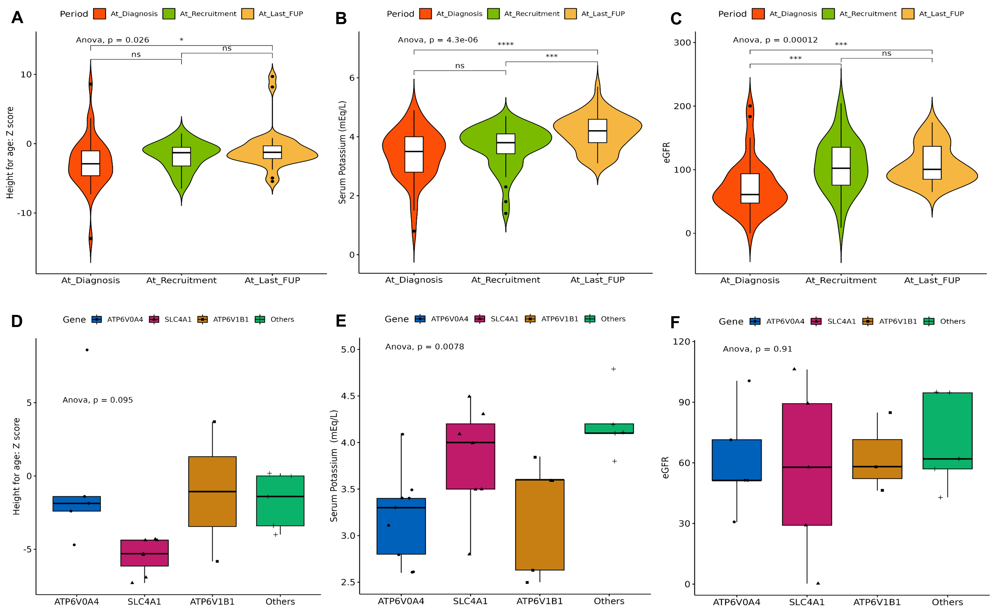

# Genetic Profile and Genotype-Phenotype correlation of Children with Primary Distal Renal Tubular Acidosis

### Hypothesis/Research question
- To determine the genetic yield of clinical exome sequencing for diagnosis of dRTA.  
- To correlate the genetic variants with the phenotypic characteristics of dRTA.  

### Findings

- Exome sequencing established a genetic diagnosis of dRTA in more than half of the cohort with a change in diagnosis in 3 children.     

- Our data showed some genotype-specific characteristics in children with distal RTA specially with respect to growth retardation, SNHL and severity of hypokalemia.     

### Samples
Total Number of Patients Screened: **60**    
Total Number of Patients Samples sequenced: **48**    
 
### Data
    
- Patients and Clinical data:  
Children with clinical diagnosis with dRTA (age group: newborn -18 years). Clinical data, Biochemical and pedigree information.     

### Study methodology

### Data analysis

- secondary analysis    

Mapping with BWA and variant calling using GATK4    

- tertiary analysis    

- genotype phenotype correlation analysis    

Student's t-test for pairwise comparisons.    
Analysis of variance (ANOVA) for group comparisons.    
R packages: `rstatix`, `ggplot2`    

### Links of Resources/Databases/Tools used

| Name | Link |
| --- | --- |
| OMIM | http://omim.org/ |
| PubMed | http://www.ncbi.nlm.nih.gov/pubmed/ |
| gnomAD | https://gnomad.broadinstitute.org/ |
| Genome Asia 100k | https://browser.genomeasia100k.org/ |
| IndiGenomes | https://clingen.igib.res.in/indigen/ |
| Human Phenotype Ontology | https://hpo.jax.org/app/ |
| UCSC Genome Browser | https://genome.ucsc.edu/ |
| Ensembl Variant Effect Predictor | https://www.ensembl.org/vep |
| ClinVar | https://www.ncbi.nlm.nih.gov/clinvar/ |
| UniProt | https://www.uniprot.org/ |
| NCBI Genetic Testing Registry | https://www.ncbi.nlm.nih.gov/gtr/ |
| Genomics England PanelApp | https://panelapp.genomicsengland.co.uk/ |
